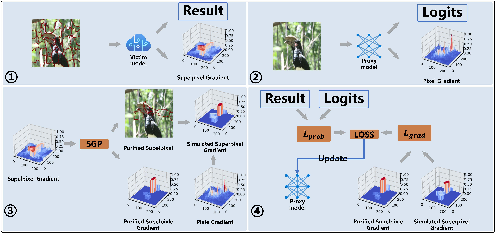

# Fully Exploiting Every Real Sample: Super-Pixel Sample Gradient Model Stealing, CVPR '24

**Yunlong Zhao · Xiaoheng Deng · Yijing Liu · Xinjun Pei · Jiazhi Xia · Wei Chen**

**Central South University · Zhejiang University**

----

Model stealing (MS) involves querying and observing the output of a machine learning model to steal its capabilities.
The quality of queried data is crucial, yet obtaining a large amount of real data for MS is often challenging.
Recent works have reduced reliance on real data by using generative models.
However, when high-dimensional query data is required, these methods are impractical due to the high costs of querying and the risk of model collapse.
In this work, we propose using sample gradients (SG) to enhance the utility of each real sample, as SG provides crucial guidance on the decision boundaries of the victim model.
However, utilizing SG in the model stealing scenario faces two challenges: 1. Pixel-level gradient estimation requires extensive query volume and is susceptible to defenses. 2. The estimation of sample gradients has a significant variance.
This paper proposes Superpixel Sample Gradient stealing (SPSG) for model stealing under the constraint of limited real samples.
With the basic idea of imitating the victim model's low-variance patch-level gradients instead of pixel-level gradients, SPSG achieves efficient sample gradient estimation through two steps. First, we perform patch-wise perturbations on query images to estimate the average gradient in different regions of the image.
Then, we filter the gradients through a threshold strategy to reduce variance. Exhaustive experiments demonstrate that, with the same number of real samples, SPSG achieves accuracy, agreements, and adversarial success rate significantly surpassing the current state-of-the-art MS methods.



  

## Installation

### Environment
  * Python 3.6
  * Pytorch 1.1

Can be set up as:
```bash
$ conda env create -f environment.yml   # anaconda; or
$ pip install -r requirements.txt       # pip
```

### Datasets
Our research is implemented based on modifications to KnockoffNets ([Link](https://github.com/tribhuvanesh/knockoffnets)).
You will need six datasets to perform all experiments in the paper, all extracted into the `data/` directory.
 * Victim datasets
   * Caltech256 ([Link](http://www.vision.caltech.edu/Image_Datasets/Caltech256/). Images in `data/256_ObjectCategories/<classname>/*.jpg`)
   * CUB-200-2011 ([Link](http://www.vision.caltech.edu/visipedia/CUB-200-2011.html). Images in `data/CUB_200_2011/images/<classname>/*.jpg`)
   * Indoor Scenes ([Link](http://web.mit.edu/torralba/www/indoor.html). Images in `data/indoor/Images/<classname>/*.jpg`)
   * Diabetic Retinopathy ([Link](https://www.kaggle.com/c/diabetic-retinopathy-detection). Images in `data/diabetic_retinopathy/training_imgs/<classname>/*.jpg`)
 * Adversarial datasets
   * ImageNet ILSVRC 2012 ([Link](http://image-net.org/download-images). Images in `data/ILSVRC2012/training_imgs/<classname>/*.jpg`)
   * OpenImages ([Link](https://storage.googleapis.com/openimages/web/index.html). Images in `data/openimages/<classname>/*.jpg`)

## Attack: Overview

The commands/steps below will guide you to:
  1. Train victim models (or download pretrained models)
  1. Train SPSG models (or download pretrained models)
     1. Constructing transfer sets
     1. Training SPSG models 

## Victim Models
We follow the convention of storing victim models and related data (e.g., logs) under `models/victim/P_V-F_V/` (e.g., `cubs200-resnet34`).

### Option A: Download Pretrained Victim Models

Zip files (containing resnet-34 pytorch checkpoint `.pth.tar`, hyperparameters and training logs):
  * [Caltech256](https://datasets.d2.mpi-inf.mpg.de/orekondy19cvpr/victim_models/caltech256-resnet34.zip) (Accuracy = 78.4%)
  * [CUBS200](https://datasets.d2.mpi-inf.mpg.de/orekondy19cvpr/victim_models/cubs200-resnet34.zip)  (77.1%)
  * [Indoor67](https://datasets.d2.mpi-inf.mpg.de/orekondy19cvpr/victim_models/indoor67-resnet34.zip) (76.0%)
  * [Diabetic5](https://datasets.d2.mpi-inf.mpg.de/orekondy19cvpr/victim_models/diabetic5-resnet34.zip) (59.4%)

### Option B: Train Victim Models
 
```bash
# Format:
$ python SPSG/victim/train.py DS_NAME ARCH -d DEV_ID \
        -o models/victim/VIC_DIR -e EPOCHS --pretrained
# where DS_NAME = {cubs200, caltech256, ...}, ARCH = {resnet18, vgg16, densenet161, ...}
# if the machine contains multiple GPUs, DEV_ID specifies which GPU to use

# More details:
$ python SPSG/victim/train.py --help

# Example (CUB-200):
$ python SPSG/victim/train.py CUBS200 resnet34 -d 1 \
        -o models/victim/cubs200-resnet34 -e 10 --log-interval 25 \
        --pretrained imagenet
```

## Training SPSG Models

We store the SPSG models and related data (e.g., transfer set, logs) under `data/adversary/P_V-F_A-pi/`  (e.g., `cubs200-resnet50-random`).

### Transfer Set Construction

```bash
# Format
$ python SPSG/adversary/transfer.py random models/victim/VIC_DIR \
        --out_dir models/adversary/ADV_DIR --budget BUDGET \
        --queryset QUERY_SET --batch_size 8 -d DEV_ID
# where QUERY_SET = {ImageNet1k ,...}

# More details
$ python SPSG/adversary/transfer.py --help

# Examples (CUB-200):
# Random
$ python SPSG/adversary/transfer.py random models/victim/cubs200-resnet34 \
        --out_dir models/adversary/cubs200-resnet34-random --budget 80000 \
        --queryset ImageNet1k --batch_size 8 -d 2
# Adaptive
$ python SPSG/adversary/transfer.py adaptive models/victim/cubs200-resnet34 \
        --out_dir models/adversary/cubs200-resnet34-random --budget 80000 \
        --queryset ImageNet1k --batch_size 8 -d 2
```

### Training SPSG

```bash
# Format:
$ python SPSG/adversary/train.py models/adversary/ADV_DIR ARCH DS_NAME \
        --budgets BUDGET1,BUDGET2,.. -d DEV_ID --pretrained --epochs EPOCHS \
        --lr LR
# DS_NAME refers to the dataset used to train victim model; used only to evaluate on test set during training of SPSG

# More details:
$ python SPSG/adversary/train.py --help

# Example (CUB-200)
$ python SPSG/adversary/train.py models/adversary/cubs200-resnet34-random \
        resnet34 CUBS200 --budgets 60000 -d 0 --pretrained imagenet \
        --log-interval 100 --epochs 200 --lr 0.01 
```

 


## Citation
If you found this work or code useful, please cite us:
```
@inproceedings{zhao2024fully,
title={Fully Exploiting Every Real Sample: Super-Pixel Sample Gradient Model Stealing},
author={Yunlong, Zhao and Xiaoheng, Deng and Yijing, Liu and Xinjun, Pei and Jiazhi, Xia and Wei, Chen},
booktitle={CVPR},
year={2024}
}
```


## Contact
In case of feedback, suggestions, or issues, please contact Yunlong Zhao(zhaoyl741@csu.edu.cn)
